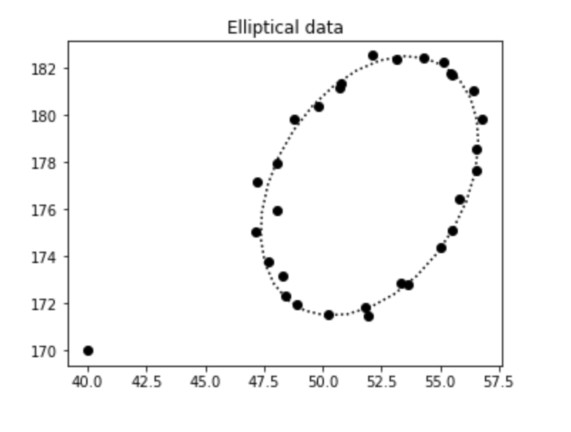

# Levenberg–Marquardt Optimization
The Levenberg–Marquardt algorithm is applied here to fit elliptical datasets with an interpolated method between Gauss–Newton and gradient descent. It is a robust method and works well even for very noisy datasets. It was developed for normalizing magnetometer datasets but is general for fitting any elliptical data.

Take a look at the general desciption of [Levenberg–Marquardt](https://en.wikipedia.org/wiki/Levenberg–Marquardt_algorithm) or of the original publication implemented in Fortran [MINPACK-1 1/2](opt/ANL8074a.pdf), [MINPACK-1 2/2](opt/ANL8074b.pdf) or [USER GUIDE FOR MINPACK-1](opt/CM_P00068642.pdf)

The Fortran code of MINPACK has been integrated into [scipy.optimize.curve_fit](https://docs.scipy.org/doc/scipy/reference/generated/scipy.optimize.curve_fit.html) which we will make use of here.

## Fitting elliptical dataset with LM

The dotted line is the LM fit of the  noisy elliptical dataset, with a far outlier added bottom left.

